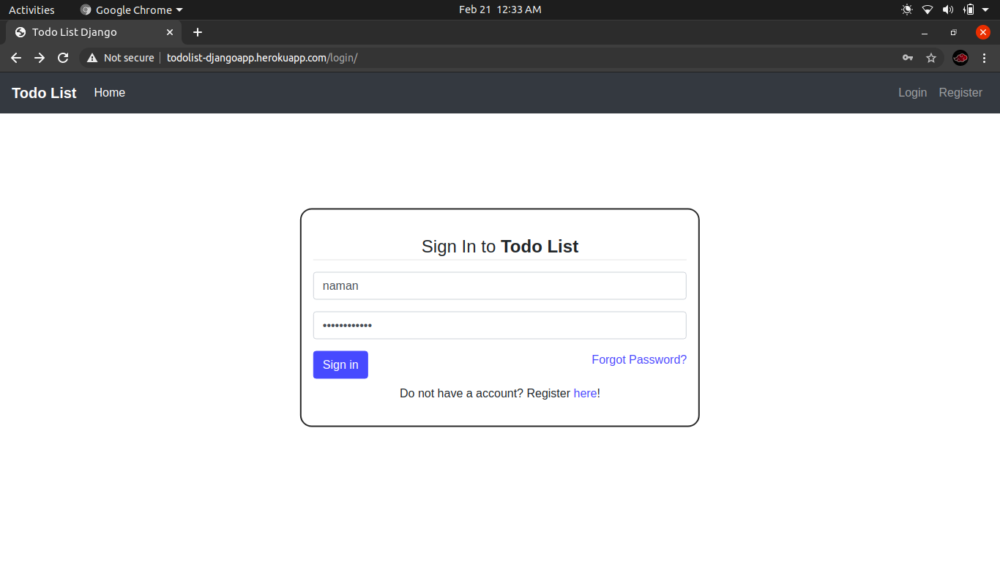
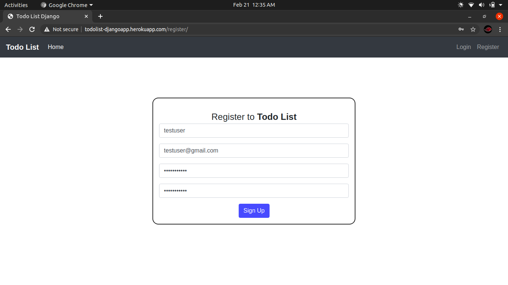
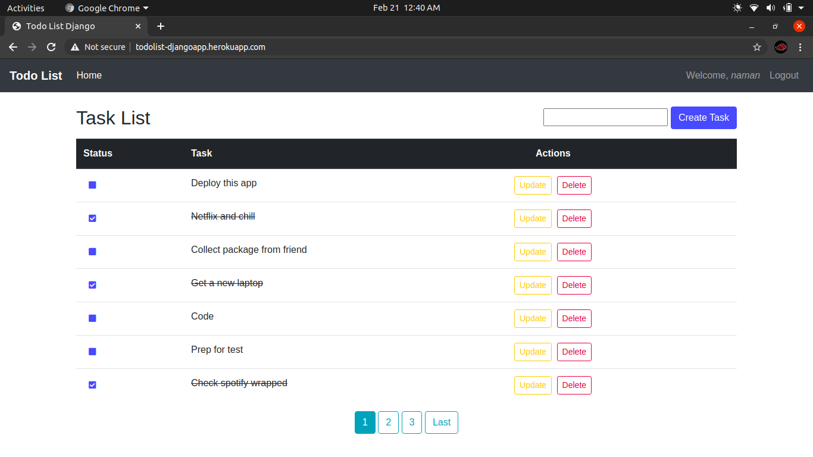
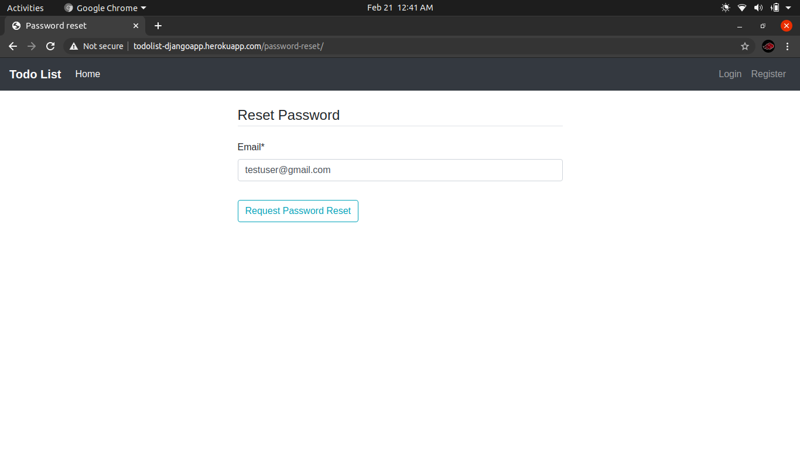

# Todo Application - Django
[](https://www.djangoproject.com/ "Django")
[](https://www.python.org "Python")
[](https://todolist-djangoapp.herokuapp.com/)

## About
Todo List, a Django based web application, deployed through Heroku.
<br>Check it out here: https://todolist-djangoapp.herokuapp.com/

## Features
- User authentication
- Create, update, strike off and delete tasks
- Pagination
- Update username and email
- Reset password via email

## Setup

Clone the repo:
```bash
$ git clone https://github.com/namanshah01/todo-django.git
```
Now cd into cloned repo, pip install the requirements
```bash
$ pip install -r requirements.txt
```
Create and apply the migrations
```bash
$ python manage.py makemigrations
$ python manage.py migrate
```
Create a superuser for admin privilages
```bash
$ python manage.py createsuperuser
```
Now set the variables `TODO_DJANGO_SECRET_KEY`, `DEBUG_VALUE`, `TODO_DJANGO_EMAIL_USER` and `TODO_DJANGO_EMAIL_PASSWORD` from `todo_app/settings.py` either as environment variables or hard code them into the file itself.
<br>Start the server
```bash
$ python manage.py runserver
```
Head over to http://localhost:8000/ so use the application


## Snapshots




---
<h3 align="center"><b>Developed with :heart: by Naman Shah</b></h1>
